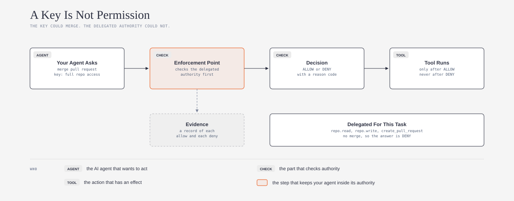
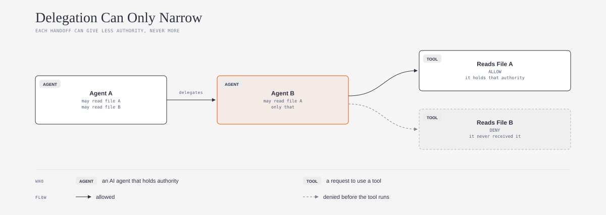
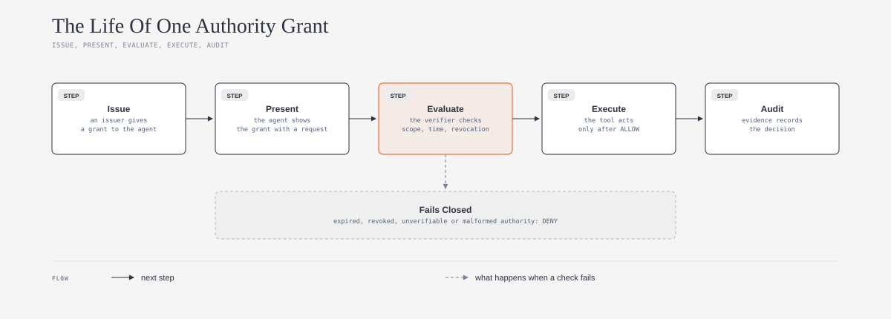

# oaaf-explained

## What is it?

This repository is a plain-language guide and an agent skill. Both are based on the Open Agent Authority Framework (OAAF), an open framework for delegated authority. OAAF tells you how to give an AI agent only the authority that a task needs. It also tells you how to check that authority before each action, and how to prove it later.



*Do you want the technical words in plain English? Refer to the [Jargon Buster](JARGON.md).*

## What problem does it solve?

An API key or a login token tells you what a process can access. It does not tell you what the agent has permission to do for this one task. Thus, most agents hold more access than the task needs. If a prompt injection or a bug tricks the agent, the agent can use all of that access. OAAF adds a check before each consequential action, so that the agent can only do what a person delegated to it.

## Who is it for?

This guide is for small teams and solo builders who put AI agents into real work. For example, an agent that changes code, sends messages, or uses business tools for your team. You do not need to write code to use the skill. The skill uses the open [Agent Skills](https://agentskills.io) format (`SKILL.md`), so it works with Claude, Codex, GitHub Copilot, and other AI agents that support this format.

## Safe by default

1. **Read and draft first.** The skill reads your project and writes drafts. It does not change files, issue grants, or change access before you approve.
2. **No secret keys in the chat.** The skill never asks for a private key, a token, or a password. Do not paste them into the chat.
3. **Honest results.** The skill tells you which actions have no check today. It does not say that your agent is safe when the evidence is missing.
4. **Your files stay yours.** The drafts go into your project folder. You can read, change, or delete them at any time.

## What does it do?

Ask your AI agent to check the authority of your agent. The skill helps your AI agent to do these steps:

1. Make a list of the tools and actions of your agent
2. Find the consequential actions, which are actions with an effect that is difficult to undo
3. Compare the access that the agent holds with the authority that each task needs
4. Find the location of an enforcement point in front of each consequential action
5. Write a draft authority grant for one task, with only the capabilities that the task needs
6. Make a plan to keep evidence of each allow and each deny

The skill also looks for three frequent mistakes. The first mistake is to use an API key as the only control. The second mistake is a check that the agent can go around. The third mistake is a sub-agent that gets more authority than the agent that delegated to it.

## How does it work?

*The diagrams below use the visual language of [cathrynlavery/diagram-design](https://github.com/cathrynlavery/diagram-design):*



When one agent gives work to a second agent, it can only give a smaller set of authority. In this example, Agent B can read file A. Agent B cannot read file B, because Agent A did not delegate it. OAAF checks this narrowing with cryptography before anything consequential occurs.



An issuer gives a grant to the agent. The agent shows the grant with each request. The verifier checks the scope, the validity time, and the revocation state. The tool acts only after ALLOW, and evidence records each decision. If a check fails, the answer is DENY. OAAF calls this "fail closed".

OAAF does not replace your policy engine. OAAF asks, "Is the delegated authority valid?" Your own authorization system still asks, "Does our policy permit this action?" A valid authority can still get DENY from your policy.

## How to install

First, make a folder with the name `oaaf-authority`. Put `SKILL.md` from this repository in that folder. Then do the steps for your AI agent.

### One command for all agents

If you have Node.js, run this command in a terminal. The command installs the skill for Claude Code, Codex, GitHub Copilot, and other agents.

```
npx skills add ams-builds/oaaf-explained
```

To get the latest version later, run `npx skills update`. The command uses [skills](https://github.com/vercel-labs/skills) by [Vercel](https://github.com/vercel-labs). If you do not use a terminal, use the instructions for your agent below.

### Claude

1. In claude.ai or the Claude desktop app, make a zip file of the `oaaf-authority` folder.
2. Upload the zip file in **Settings > Capabilities > Skills**.
3. In Claude Code, put the folder in `~/.claude/skills/oaaf-authority/`.

### Codex

1. Put the folder in `~/.agents/skills/oaaf-authority/` for all your projects.
2. Or, put the folder in `.agents/skills/oaaf-authority/` in one project.
3. Or, tell Codex to use `$skill-installer` with the GitHub URL of this repository.
4. If the skill does not show, start Codex again. Source: [Codex skills documentation](https://learn.chatgpt.com/docs/build-skills).

### GitHub Copilot

1. Put the folder in `~/.copilot/skills/oaaf-authority/` for all your projects.
2. Or, put the folder in `.github/skills/oaaf-authority/` in one repository.
3. Use Copilot in agent mode. Source: [GitHub Copilot skills documentation](https://docs.github.com/en/copilot/how-tos/copilot-cli/customize-copilot/create-skills).

These three agents are the most used AI coding agents in the [JetBrains 2026 survey](https://blog.jetbrains.com/research/2026/08/ai-coding-agent-adoption-2026/). Other agents that support Agent Skills use the same `SKILL.md` file. Refer to the documentation of your agent for the folder.

## How to use it

After you install the skill, speak to your AI agent in your usual words:

- "Check the delegated authority of my agent"
- "Which actions can my agent do that it does not need?"
- "Where do I put an OAAF enforcement point in my agent?"

The skill starts automatically. You do not need to use its name.

## Credit and license

This guide is based on the [Open Agent Authority Framework (OAAF)](https://github.com/espradley/oaaf) by [Eddie Spradley](https://github.com/espradley), maintained by Edwin Digital LLC as initial steward. This guide explains the source at commit `a77116f` (18 August 2026), OAAF Core 1.0 contract, reference packages 0.1.0. That project uses the Apache License 2.0. This repository uses the same license. Refer to [LICENSE](LICENSE) and [NOTICE](NOTICE).

This is an independent plain-language guide. It is not an official part of the source project. For the full rules, use the source specification.

Changes from the source:

1. I wrote the main concepts again in Simplified Technical English, for readers who are not specialists.
2. I made three new diagrams.
3. I wrote an agent skill that applies the framework to one agent.
4. I did not copy the specification, the SDKs, or the conformance corpus. The skill refers to them by their file paths in the source repository.

**Language.** I wrote the text in Simplified Technical English (ASD-STE100). The idea to ask an AI model to write in ASD-STE100 comes from [Andrej Karpathy](https://github.com/karpathy) ([his post on X](https://x.com/karpathy/status/2105819303471976479)). I used the [simplified-technical-english](https://github.com/0xpili/simplified-technical-english) agent skill by [pili](https://github.com/0xpili) to write and check the text. ASD-STE100 is a specification of ASD (AeroSpace and Defence Industries Association of Europe). This repository is not related to ASD.

---

*New words? The [Jargon Buster](JARGON.md) gives plain-English explanations of delegated authority, enforcement point, authority grant, narrowing, fail closed, and more.*
